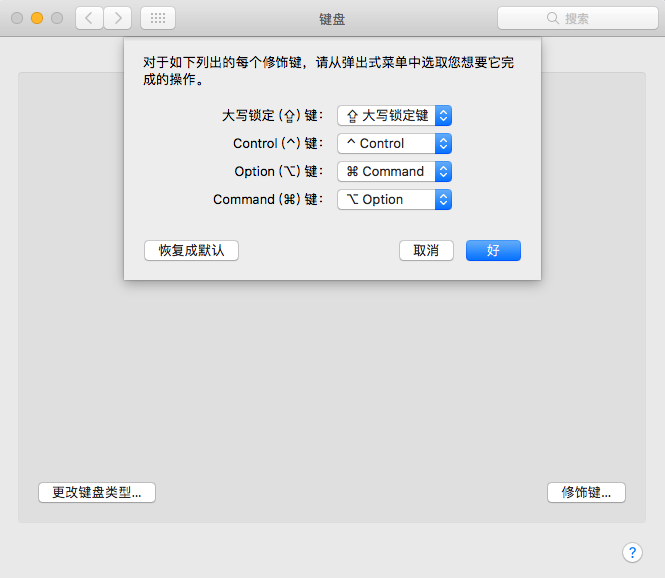
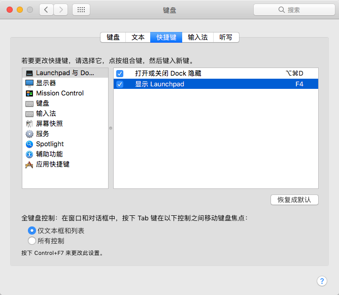
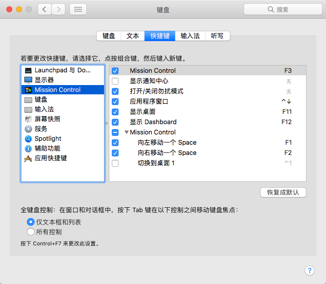

反馈请联系[**hertz@hertzwang.com**](mailto:hertz@hertzwang.com),谢谢

> 前言：装了黑苹果，Windows键盘的键位用不习惯，于是有了以下操作。

## ⌘和⌥设置

打开 `系统偏好设置`→`键盘`→`修饰键`，选择相应的键位，如图：

## Launchpad设置

打开 `系统偏好设置`→`键盘`→`修饰键`→`快捷键`→`Launchpad 与 Dock`，设置如图：

## Mission Control设置

打开 `系统偏好设置`→`键盘`→`修饰键`→`快捷键`→`Mission Control`，设置如图：

